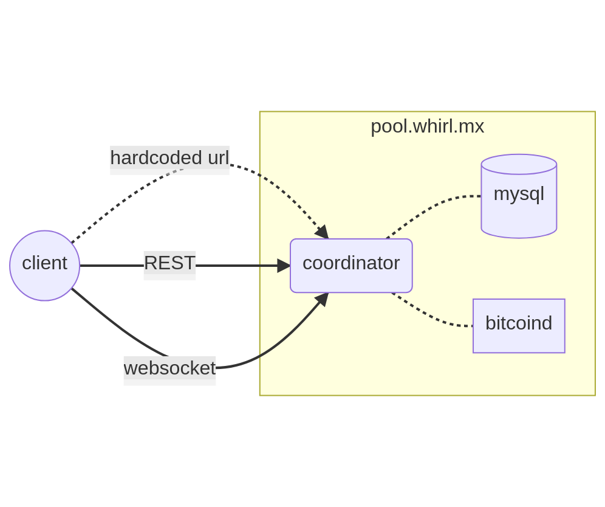

# DECENTRALIZING WHIRLPOOL COORDINATOR

## I. Current architecture
- 1 coordinator instance
    * using a MySQL server (to store banned clients, mix history, postmix address reuse...)
    * using a bitcoin node
- coordinator URL is hardcoded into client: `pool.whirl.mx`

Main issues:
- censorship: slow to recover if pool.whirl.mx were blacklisted (would require updating all clients with new hardcoded address)
- DDOS: single coordinator is an easy target
- scaling: coordinator is handling growing whirlpool traffic (900+ websocket connexions)
- mixing downtimes during coordinator upgrades

Constraints for upgrading current architecture:
- coordinator side:
    * coordinator requires a centralized MYSQL database (for storing mix history, banned users, postmix address-reuse...)
- client side: 
    * keep changes as small as possible for client to make upgrade easier for whirlpool partners
    * keep current mixing protocol unchanged

    
## II. Proposal

### 1. Coordinator side
- spawn multiple coordinator instances (same config)
- each intance has its own url clearnet + onion
- each instance is connected to a shared mysql database:
    * clients are banned from all instances simultaneously
    * postmix address reuse protection across all instances
    * "status dashboard" shows all instances activity. The dashboard is accessible from any instance.

### 2. Pools repartition

- pools are repartited among coordinator instances
- each instance is responsible of [0-N] pools and manages pool's liquidities and mixs
- if there are more instances than pools, additional instances are IDLE. They will be assigned to a pool when an active instance goes offline

- when an instance goes offline:
    * orphean pools are reassigned across active instances
    * mixing clients from orphean pools a disconnected and reconnect to the new instance

- if only one instance up, it's managing every pools:

- synchronization is in real time by using the shared MySQL database

### 3. Client side
- client has an hardcoded bootstrap node list locally
- client connects to a random instance from the bootstrap list

- if the random instance is not responsible of client's mixing pool, client gets redirected to the responsible instance
- client connects to this instance and starts mixing as usual

### 4. Remarks
- decentralization is 100% transparent to the client
- no protocol upgrade (except instance redirection response)
- coordinator instances are synchronized in real-time with the shared MySQL database
- no need to implement Soroban client for mixing

