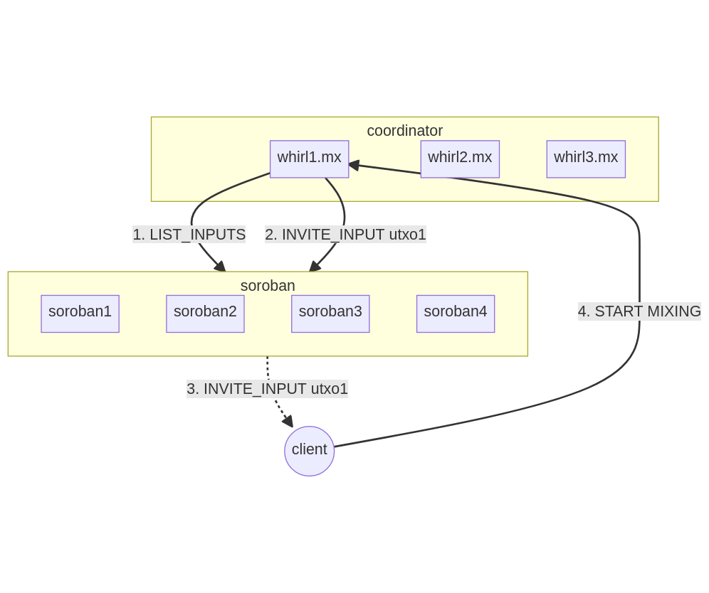
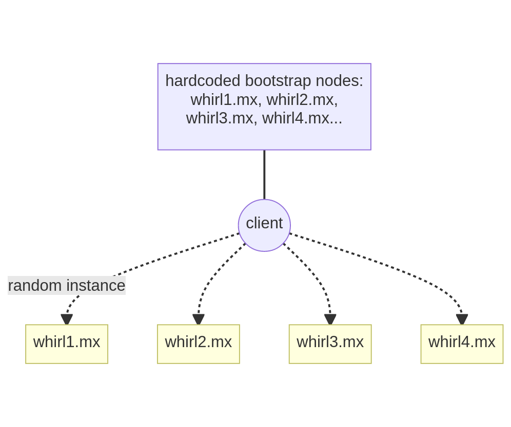
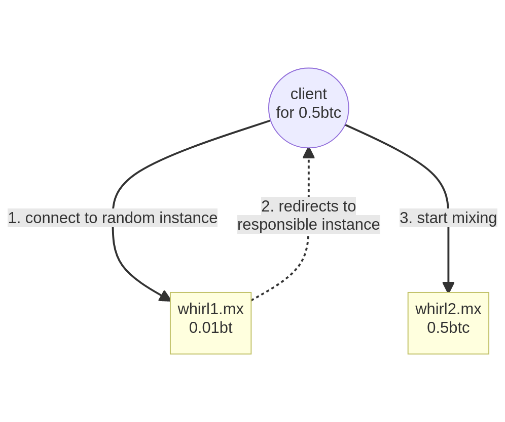
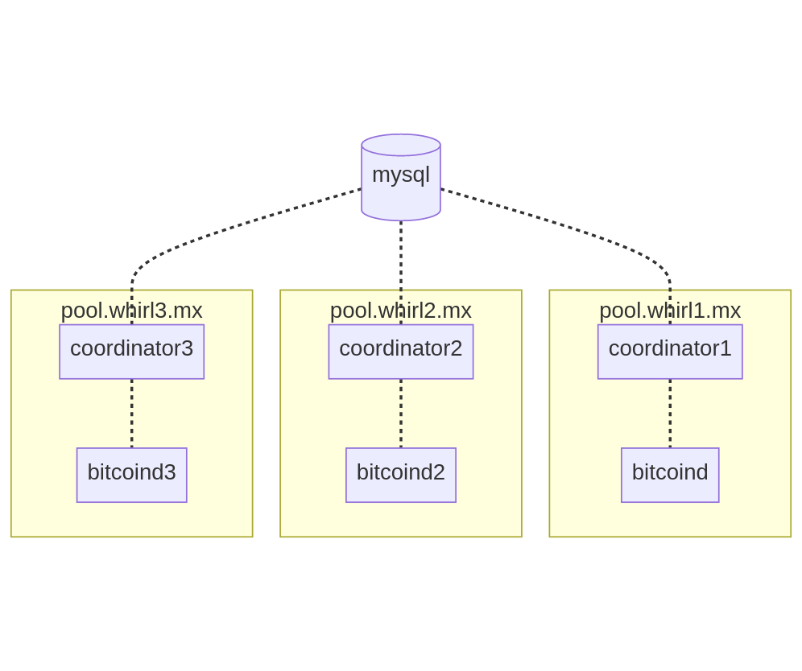
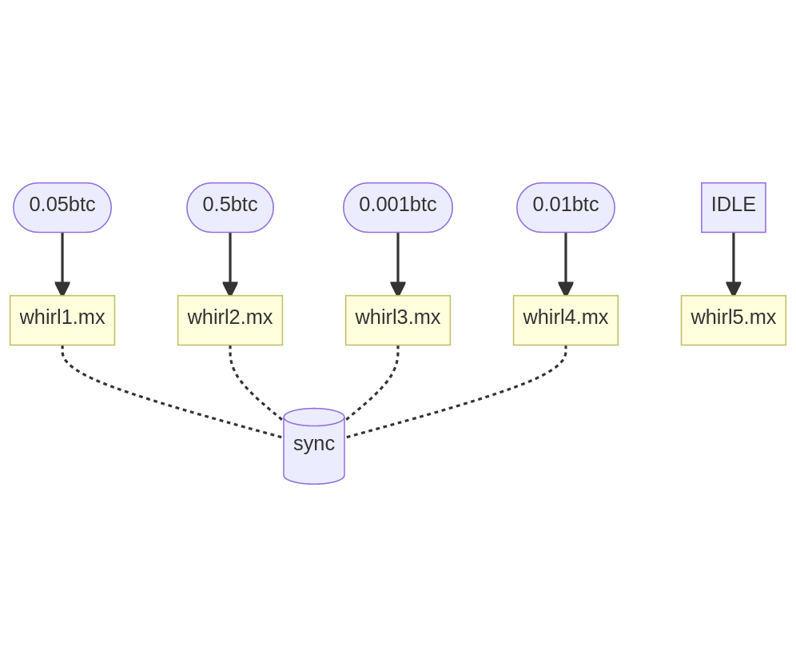
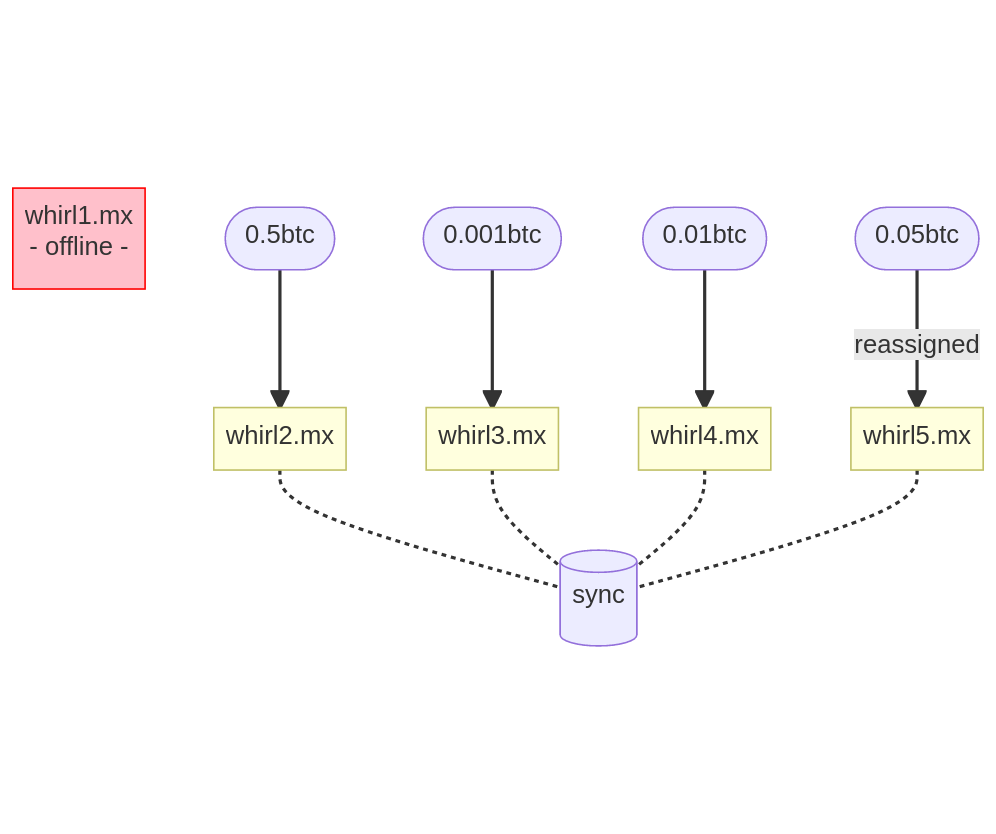
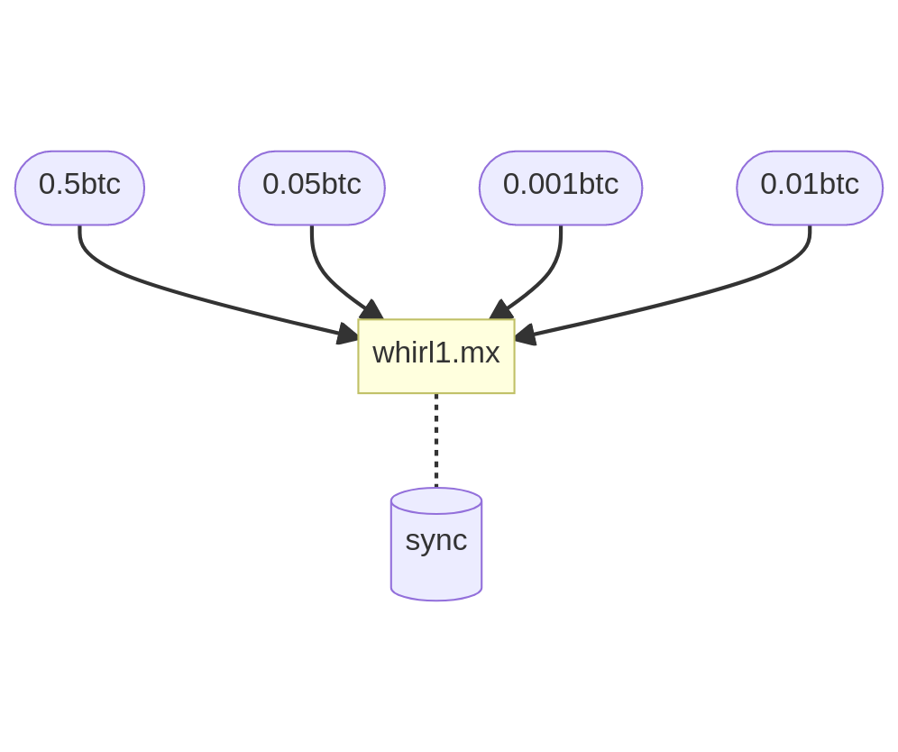

# DECENTRALIZING WHIRLPOOL

## I. Proposal #1

### 1. Client registers  to Soroban
- hardcoded bootstrap Soroban nodes on client side
- client connects to a random node
- client registers UTXO to mix on soroban  
    `REGISTER_INPUT {poolId, utxoHash, utxoIndex, signature, liquidity}`

### 2. Coordinator invites client for mixing
- coordinator instance lists registered inputs from Soroban  
    `LIST_INPUTS {poolId}`
- coordinator instance invites utxos to mix  
    `INVITE_INPUT {poolId, instanceIp}`
- client starts mixing with coordinator instance as usual

### 3. TL;DR
- need to implement Soroban + INVITE_INPUT on client side for each partner
- slow to detect client disconnection
- privacy: make utxos list private on Soroban?

## II. Proposal #2
### 1. Client connects as usual to random coordinator instance
- hardcoded bootstrap coordinator nodes on client side
- client connects to a random coordinator instance from the bootstrap list

### 2. Coordinator instance redirects to appropriate instance
- each coordinator instance is responsible of one mixing pool
- if the random instance is not responsible of client's mixing pool, client gets redirected to the responsible instance
- client connects to this instance and starts mixing as usual

### 3. TL;DR
- no need to implement Soroban on client side
- no protocol upgrade (except instance redirection response)
- need of coordinator synchronization (mysql, soroban, other?)

## III. Coordinator decentralization

### 1. Instances
- spawn multiple coordinator instances (same config)
- each intance has its own url clearnet + onion
- each instance is connected to a shared mysql database:
    * clients are banned from all instances simultaneously
    * postmix address reuse protection across all instances
    * "status dashboard" shows all instances activity. The dashboard is accessible from any instance.

### 2. Pools repartition

- pools are repartited among coordinator instances
- each instance is responsible of [0-N] pools and manages pool's liquidities and mixs
- if there are more instances than pools, additional instances are IDLE. They will be assigned to a pool when an active instance goes offline

- when an instance goes offline:
    * orphean pools are reassigned across active instances
    * mixing clients from orphean pools a disconnected and reconnect to the new instance

- if only one instance up, it's managing every pools:

### 3. TL;DR
- one responsible coordinator per mixing pool
- coordinator instances are synchronized in real-time (with shared MySQL database?)

