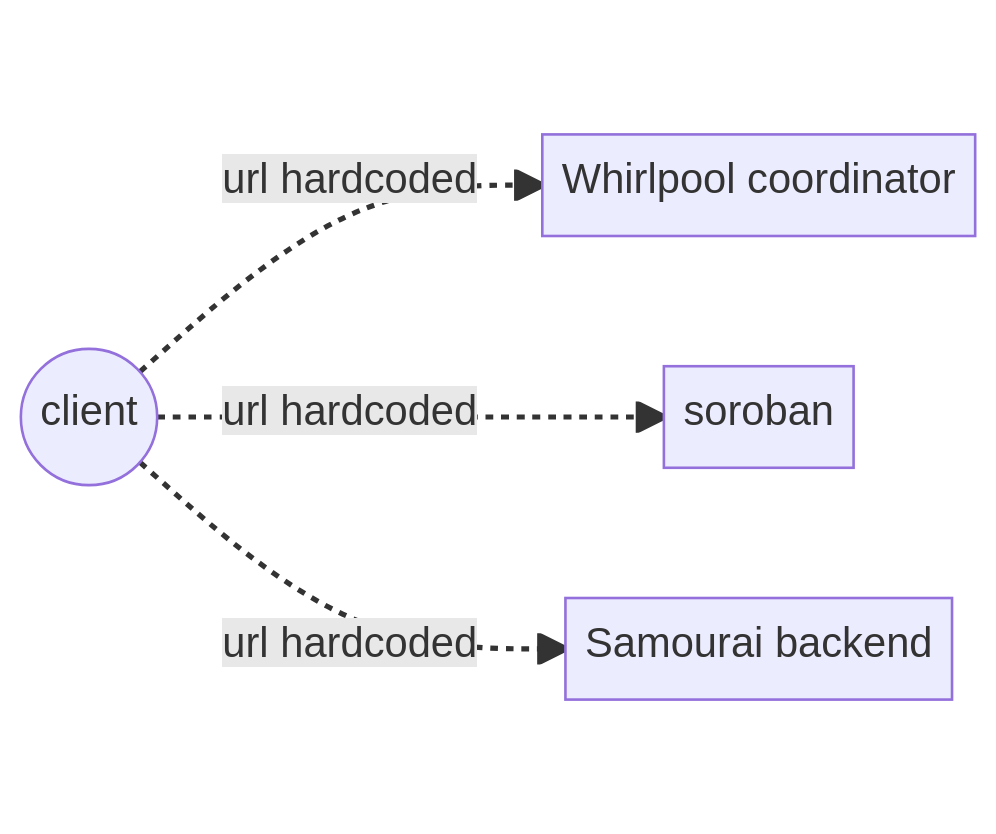

# DECENTRALIZING SAMOURAI

## I. Current architecture
- URLs are hardcoded into Java librairies
- single server per service

## II. Decentralizing Whirlpool
See [README-whirlpool.md](README-whirlpool.md)

## III. Decentralizing Soroban
TODO

## IV. Decentralizing Samourai backend
TODO